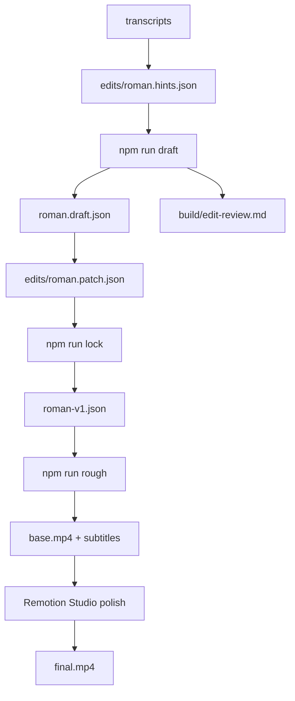

# Tokr — JSON edit-list video pipeline

Reusable pipeline for assembling talking-head TikToks from short clips.

## Workflow (draft → tweak → polish)



### 1. Hints (intent)

Edit [`edits/roman.hints.json`](edits/roman.hints.json):

- `mustInclude` / `mustExclude` — phrases that must / must not appear
- `excludeAssets` / per-beat `preferAssets` — force or ban takes
- `beats[]` — narrative slots the selector fills
- `overlayHints[]` — which graphics attach to which spoken terms
- `targetDurationSec` — soft min/max for the rough cut

### 2. Auto draft

```bash
npm run draft
```

Writes:

- [`edits/roman.draft.json`](edits/roman.draft.json) — proposed edit decision list
- [`build/edit-review.md`](build/edit-review.md) — transcripts, why each take won, coverage checklist

### 3. Tweak

**A. Change hints and re-run `npm run draft`** — best for “drop the privacy beat”, “force couch cushions”, “under 3:30”.

**B. Surgical patch** — edit [`edits/roman.patch.json`](edits/roman.patch.json):

```json
{
  "version": 1,
  "remove": ["c_IMG_7975"],
  "replace": [{ "clipId": "c_IMG_7963", "withAsset": "IMG_7966" }],
  "trim": [{ "clipId": "c_IMG_7974", "srcIn": 2.0, "srcOut": 28.0 }],
  "insert": [{ "afterClipId": "c_IMG_7960", "asset": "IMG_7958" }],
  "order": ["c_IMG_7954", "c_IMG_7959"]
}
```

See [`edits/roman.patch.example.json`](edits/roman.patch.example.json) for a worked example.

Then lock:

```bash
npm run lock
```

→ [`edits/roman-v1.json`](edits/roman-v1.json)

### 4. Rough cut (watch before full Remotion render)

```bash
npm run rough
```

Cuts + loudnorms + remaps subtitles + syncs into `video/public/`. Open `build/base.mp4` or `npm run studio`.

### 5. Polish in Remotion Studio

Overlays, flair (`"flair": "Goldilocks"` on a subtitle word), karaoke spacing — then:

```bash
npm run render
```

## Commands

| Script | What it does |
|--------|----------------|
| `npm run transcribe` | Whisper word timestamps → `transcripts/` |
| `npm run draft` | hints → draft edit + review markdown |
| `npm run lock` | draft + patch → locked `roman-v1.json` |
| `npm run rough` | lock + cut + subtitles + sync-public |
| `npm run studio` | Remotion live preview |
| `npm run render` | Final 1080×1920 mp4 |

## Layout

```
pipeline/     # select, patch, cut, subtitles, remap
video/        # Remotion (Final + graphics + flair)
edits/        # hints, draft, patch, locked edit
transcripts/  # Whisper JSON per clip
roman-assets/ # Source footage
build/        # base.mp4, edit-review.md, final.mp4
```
